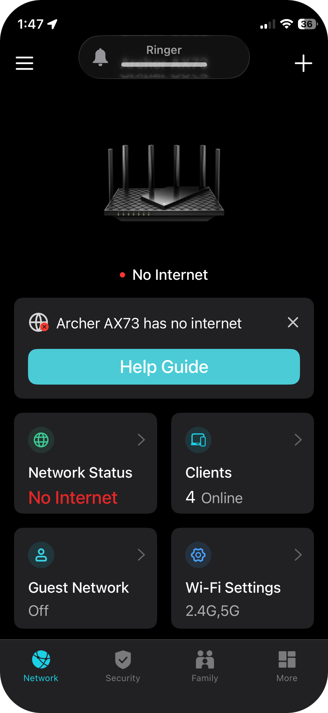

# Satellite Gamelan

The Satellite Gamelan app is designed for a large group of musicians to perform concert music using mobile phones. Performance relies on miniature speakers projecting into reverberant concert venues that were designed to project the unamplified sound of multiple hand-held instruments and a cappella voices.

This project renders a synchronised multiplayer interface using gesture-triggered audio and ES6 canvas animation. It was designed as a [concert app](https://satellitegamelan.com) to perform microtonal music composed by the developer initially to explore microtonal tuning theories of [Erv Wilson](https://www.anaphoria.com/wilson.html). This version supports a work that explores harmonic properties of a tuning system with 25 equally spaced intervals, devised by Karlheinz Stockhausen for his 1954 electronic work [*Studie II*](https://joachimheintz.de/stuecke/code/stockhausen_studie_II_LAC_2010.pdf). The source code here is intended as an eventual replacement of the original app written in Objective-C. It uses a combination of javaScript and [Csound](https://csound.com/index.html) [WebAssembly](https://github.com/orgs/csound/people) and draws on the work of New Zealand composer and computer music pioneer [Barry Vercoe](https://www.media.mit.edu/posts/in-memoriam-barry-lloyd-vercoe-1937-2025/) and an international community of [Csound developers](https://github.com/csound/csound#contributors). In the spirit of Vercoe I have released the code into the wild.

The app features instruments that are easy to play and quick to learn, enabling musicians to explore uncharted harmonic spaces rarely visited using standard musical instruments. Every phone becomes a mobile sound source in a large harmonic constellation and a hand-held stage light that enhances concert presentation.

## Features

- 🎵 **Csound audio synthesis** via dynamic gesture-triggered loading
- 🌐 **Async** server provides secure **HTTP** and **WebSocket** services
- ✅ Mobile-friendly, multi-player, autoplay-policy compliant
- 🔁 Collaborative GUI for a consort of players synchronised by a lead player
- 🎨 Canvas-based layout and animation in pure ES6 modules
- 📡 **Application** runs untethered from the internet

The app is downloaded to phones via a Wi-Fi Router. The app is launched using 1 of 2 html files depending on the role :

- **Lead player** (`leader.html`) — lead player taps the digital clock readout to start an animation sequence that drives the performance
- **Consort** (`consort.html`) — all players trigger sounds by tapping sprites enabled by the animation sequence
- Both versions display the same 25-key layout and interactive clock
- The lead player syncs the consort via a Wi-Fi 6 Router

The leader's role is: 
- to start the animation sequence in sync on all phones;
- to select 1 of 2 playing modes for playing the animation sequence :

    1. **PREVIEW** : plays 'fast-forward' giving players an overview of the changing UI
    2. **CONCERT** : plays in real-time and lasts between 12:24 and 12:48 seconds 

## Player instructions

The app has an animated sequence of states where 25 coloured keys appear and disappear at various times during the performance.

- before starting the performance players set phones in wake mode

- the sequence starts when the lead player taps the clock 

- players trigger notes by tapping keys as they appear

- in each state a player may play up to 5 notes


<p>
  
  
  
</p>

## Tuning

This section is for anyone curious about why the Satellite Gamelan app sounds the way it does. It shows how a scale that does not repeat at the octave can nevertheless sound surprisingly close to the familiar conventional scale that divides the octave into twelve equal intervals. Stockhausen’s scale divides a much larger 5:1 harmonic span into twenty-five equal steps, producing distinctive timbral qualities unlike those of many octave-based scales used in world music. We may never know whether he was fully aware of its rich harmonic vocabulary, but it is remarkable to think he created it using the stock-in-trade of 1950s broadcast studios: magnetic tape, chinagraph pencil, splicing block, and razor blade. Tuning resources developed in Csound now make this scale accessible for experimentation by other musicians. These resources have been adopted for the Satellite Gamelan app and can also be reused by users of hand-held mobile synthesisers who would like to explore other musical scales.


**[Stockhausen's Scale](assets/docs/stockhausen_25root5.pdf)**

This shows 
- how the 25 pitches are calculated and mapped to 25 keys on a hand-held digital synthesiser
- where the 25 pitches sit in comparison to notes on a conventional music stave, and
- how close they are to the 5-limit harmonic ratios they approximate.

## 📁 Project Structure

Actual `.pem` certificate files are omitted here for clarity.

```
.
├── apple-touch-icon-precomposed.png
├── apple-touch-icon.png
├── assets
│   ├── bash
│   │   └── zshrc
│   ├── certs
│   ├── csd
│   │   ├── phonehenge-0.csd
│   │   ├── phonehenge-1.csd
│   │   ├── phonehenge-2.csd
│   │   ├── phonehenge-3.csd
│   │   ├── phonehenge-4.csd
│   │   ├── sprite-chords.orc
│   │   ├── sprite-single.csd
│   │   └── sprite-single.orc
│   ├── python
│   │   ├── make-qr.py
│   │   └── server.py
│   └── qr-images
│       ├── qr-consort.png
│       └── qr-leader.png
├── consort.html
├── css
│   └── bootstrap.min.css
├── favicon.ico
├── js
│   ├── gui
│   │   ├── animation.js
│   │   ├── audioEngine.js
│   │   ├── canvasExtensions.js
│   │   ├── canvasUtils.js
│   │   ├── clockBus.js
│   │   ├── clockTransport.js
│   │   ├── color.js
│   │   ├── csoundInit.js
│   │   ├── globals.js
│   │   ├── helpers.js
│   │   ├── henge.js
│   │   ├── main.js
│   │   ├── net.js
│   │   ├── renderer.js
│   │   ├── runTime.js
│   │   ├── satgamPing.js
│   │   ├── sequence.js
│   │   ├── sprites.js
│   │   ├── text.js
│   │   ├── uiControls.js
│   │   └── wakeLock.js
│   └── synth
│       ├── csound6
│       │   ├── csound.js
│       │   └── csound.js.map
│       └── csound7
│           ├── csound.js
│           └── csound.js.map
├── leader.html
├── LICENSE
└── README.md

16 directories, 58 files

```
## Getting Started

### How to create and use HTTPS certificates on the SatGam Server for the concert network

This guide assumes SatGam lives at:

```
		/Users/gs/Developer/SG/SatGam
```

SatGam’s browser audio path uses secure-context web features associated with Csound WebAssembly, so for phone deployment it must be served over **HTTPS** with **WSS** for WebSockets.

Certificates must be created for the **SatGam Server** running on the MacBook Pro. Phones reach the server through a concert network using a **tp-link AX73 Wi-Fi 6 Router**.

In this setup:

- **MacBook Pro** runs `aio_server.py`
- **AX73 wireless router** provides the private LAN and Wi-Fi
- `mkcert` creates the SatGam server certificate and its local certificate authority (CA) 
- **phones** connect to the MacBook through the AX73 network
---

---
**Part 1 — Satellite Gamelan server : aio_server.py**

aio_server.py is run from **Terminal**. Start in the root directory of the SatGam project:

```
	cd /Users/gs/Developer/SG/SatGam
```

Then run the server:

```
	python3 assets/python/aio_server.py \
	  --port 8443 \
	  -r .
```

The default port is 8443.

When the server starts successfully, the Terminal should show messages similar to:

```
Expected output will be similar to:

```
	——— Preflight ———
	✅ no auto-start in main.js
	✅ robust wsPort parsing present (qsPort)
	⚠️ leader.html did not show a direct import during preflight (static check).
	If you see [ws] connections later, WS is wired at runtime.
	⚠️ consort.html did not show a direct import during preflight (static check).
	If you see [ws] connections later, WS is wired at runtime.
	———— End preflight ————
	[wss] Listening on wss://0.0.0.0:8444
	[https] Serving /Users/gs/Developer/SG/SatGam on https://0.0.0.0:8443
```

	**Note**
	0.0.0.0 means the server is listening on all local interfaces, including:
	* localhost
	* the home-side interface
	* the AX73-side interface
	* 192.168.1.10


	diag_client=False log_http=False log_ws=True log_assets=True log_client_status=True
	[https+wss] Serving /Users/gs/Developer/SG/SatGam
	[https+wss] https://0.0.0.0:8443
	[https+wss] WebSocket endpoint: wss://0.0.0.0:8443/ws

```

**aio_server.py** is run from **Terminal** using the following command settings :

```
	cd /Users/gs/Developer/SG/SatGam
	python3 assets/python/aio_server.py \
	  	--port 8443 \
	  	-r .
```


Additional command options include:

```
		--cert-file assets/certs/SatGam.pem

```	
			
			Uses the SatGam public certificate file.
			
	
```
		--key-file assets/certs/SatGam-key.pem

```
			
			Uses the SatGam private encryption key.
			

```
		--log-ws

```

			Displays WebSocket messages in the Terminal console log.


```
		--log-assets

```

			Identifies assets sent to phone clients.

```
		--diag-client

```

			Displays diagnostic status messages on phone clients.
	

---

**Part 2 — Satellite Gamelan Router Settings**

<p>
  
</p>

[SatGam Router Settings PDF](satgam_router_settings.pdf)

How to set up [tp-link AX73 Wi-Fi 6 Router](https://youtu.be/5nZY1M_RH-k)

** Launch the secure SatGam server**

---

**Part 3 — Create and install SatGam certificates**

Open a Terminal window and run the following commands.

1.	**Go to the SatGam folder**
```
	cd /Users/gs/Developer/SG/SatGam
```
2.	**Create and install a fresh local CA**
```
	mkcert -install
```

Expected output will be similar to:

```
	Created a new local CA 💥
	Sudo password:
	The local CA is now installed in the system trust store! ⚡️
	The local CA is now installed in the Firefox trust store (requires browser restart)! 🦊

	If Firefox is open, restart it after this step.
```

3.	**Create the SatGam server certificate and private key**

```
 	mkcert \
	  -cert-file assets/certs/SatGam.pem \
	  -key-file assets/certs/SatGam-key.pem \
	  192.168.1.10 MacBook-Pro-2.local localhost 127.0.0.1
```

Expected output will be similar to:

``` 
	Created a new certificate valid for the following names 📜
	“192.168.1.10"
	"MacBook-Pro-2.local"
	"localhost"
	"127.0.0.1"

	The certificate is at "assets/certs/SatGam.pem" and the key at "assets/certs/SatGam-key.pem" ✅
```

4.	**Copy the root CA certificate for performer-phone installation**

```
	cp "$(mkcert -CAROOT)/rootCA.pem" assets/certs/SatGam-rootCA.pem
```

This creates a clearly named copy of the mkcert root CA certificate for distribution to performers.

5.	**Validate the certificate files**
```
	ls -l assets/certs
```

Expected files:
```
	SatGam.pem
	SatGam-key.pem
	SatGam-rootCA.pem
```

Example:
```
	total 24
	-rw-------  1 gs  staff  1708 14 Apr 08:18 SatGam-key.pem
	-rw-r--r--  1 gs  staff  1781 14 Apr 08:18 SatGam-rootCA.pem
	-rw-r--r--  1 gs  staff  1614 14 Apr 08:18 SatGam.pem
```

___

**Part 4 — Create Leader and Consort QR codes**

Open another Terminal window if needed.

7.	**Generate the QR codes**

```
	cd /Users/gs/Developer/SG/SatGam
	python3 assets/python/make-qr.py \
  	--scheme https \
  	--host 192.168.1.10 \
  	--http-port 8443 \
  	--ws-port 8444
```
Expected output will be similar to:

```
	QR font file: /System/Library/Fonts/Supplemental/Arial.ttf
	QR font name: ('Arial', 'Regular')
	LABEL ROLE = 'Phonehenge - Leader'
	LABEL ROLE = 'Phonehenge - Consort'
	Base URL: https://192.168.1.10:8443
	WebSocket port: 8444
	Font size: 18
	Leader  → assets/qr-images/qr-leader.png -> https://192.168.1.10:8443/leader.html?wsPort=8444
	Consort → assets/qr-images/qr-consort.png -> https://192.168.1.10:8443/consort.html?wsPort=8444
	Scan from phones while the server is running on the same Wi-Fi.
```

8.	**Validate the QR image files**

```
	ls -l assets/qr-images
```

Expected files:
```
	qr-leader.png
	qr-consort.png
```

**Resulting secure URLs**

The QR codes should now point to:

- **Leader**

```
	https://192.168.1.10:8443/leader.html?wsPort=8444
```
- **Consort**
```
	https://192.168.1.10:8443/consort.html?wsPort=8444
```
---
## Installing SatGam Certificate Authority on Performer Phones

To allow performer phones to connect to the SatGam HTTPS server without certificate warnings, each device must install and trust the local **Certificate Authority** (**CA**).

The file to install is:

```
		assets/certs/SatGam-rootCA.pem
```
---
**iPhone (iOS) CA Installation**

1. **Transfer the certificate** to the iPhone using one of the following methods:
* AirDrop (recommended)
* Email attachment
* Host the file temporarily on the SatGam server and open it in Safari

2. **Install the profile**
- Open the .pem file on the iPhone
- You will see a message: `Profile Downloaded`
- Open **Settings**
- Tap `Profile Downloaded`
- Tap **Install**
- Enter passcode if prompted
- Tap Install again to confirm

3. **Enable full trust** (CRITICAL)
This step is required on iOS.
- Go to:
Settings → General → About → Certificate Trust Settings
- Under Enable Full Trust for Root Certificates, find:

`	SatGam-rootCA` (or similar name)
	
- Toggle it ON
- Confirm when prompted

4. **Verify**
Open Safari and test:

`	https://192.168.1.10:8443/leader.html?wsPort=8444`

If installed correctly:
* no certificate warning appears
* the page loads normally
---
**Android CA Installation**

Steps may vary slightly depending on Android version and manufacturer.

1. **Transfer** the certificate
* Email
* USB
* AirDrop equivalent
* Download from server

2. **Install the certificate**
- **Open Settings**
- Go to:

```
	Security → Encryption & credentials → Install a certificate
```

	(or search for *Install certificate*)

- **Select**

`	CA certificate`

- **Locate** and accept:

`	SatGam-rootCA.pem`

- Confirm installation:

3. **Accept**

Android will warn that:

`	Your network traffic may be monitored`

This is expected for a user-installed CA. Tap Install anyway.

4. **Verify**

Open Chrome and test:

`	https://192.168.1.10:8443/leader.html?wsPort=8444`

If installed correctly:
* no certificate warning appears
* the page loads normally

---

## Acknowledgements

- Australian Tax Payers
- Australian Research Council, 2003-2005 Discovery Project, project title : *Tuning Musical Applications for Wireless Internet* 
- [Bill Alves](assets/docs/alves_csound_book_entry.pdf)
- [Richard Boulanger](https://archive.org/details/csoundbookperspe0000unse)
- [John ffitch](https://csound.com/docs/manual/cpsxpch.html)
- [Victor Lazzarini](https://github.com/vlazzarini)
- [Thorin Kerr](https://ide.csound.com/profile/ErrorThinker)
- [Stephen Yi](https://ide.csound.com/profile/stevenyi)

## References

- K. Grady (2024) [An Extended Interview with Greg Schiemer](https://www.xenharmonikon.org/2024/09/13/an-extended-interview-with-greg-schiemer/)
- G. Schiemer (2016) [Satellite Gamelan: microtonal sonification using a large consort of mobile phones](https://www.academia.edu/103469473/Satellite_Gamelan_Microtonal_Sonification_Using_a_Large_Consort_of_Mobile_Phones)
- G. Schiemer, E. Deleflie, E. Cheng (2010) [Pocket Gamelan: Realizations of a Microtonal Composition on a Linux Phone Using Open Source Music Synthesis Software](https://www.academia.edu/1073448/Pocket_Gamelan_Realizations_of_a_Microtonal_Composition_on_a_Linux_Phone_Using_Open_Source_Music_Synthesis_Software)
- G. Schiemer and M. Op de Coul (2007) [Pocket Gamelan: tuning microtonal applications in Pd using Scala](https://ro.uow.edu.au/ndownloader/files/50561721)
- G. Schiemer (2006) [The microtonal legacy of the Pocket Gamelan](https://ro.uow.edu.au/ndownloader/files/50561544)
- G. Schiemer and M. Havryliv (2006) [Pocket Gamelan: tuneable trajectories for flying sources in *Mandala 3* and *Mandala 4*](https://www.academia.edu/85041071)
- G. Schiemer and M. Havryliv (2005) [Pocket Gamelan: a Pure Data interface for Mobile phones](https://www.nime.org/proceedings/2005/nime2005_156.pdf)
- T. Narushima (2018) [Microtonality and the Tuning Systems of Erv Wilson](https://www.routledge.com/Microtonality-and-the-Tuning-Systems-of-Erv-Wilson/Narushima/p/book/9781138857568)
- S. J. Taylor (2011) [The Sonic Sky](https://vimeo.com/29632431?fl=pl&fe=vl)

## satellitegamelan.net

- [index](https://satellitegamelan.com/index.php)
- [links](https://satellitegamelan.com/links.php)
- [gallery](https://satellitegamelan.com/gallery.php)
- [about](https://satellitegamelan.com/about.php)

```
