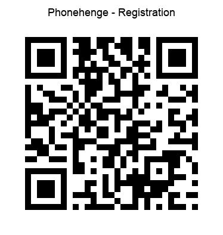
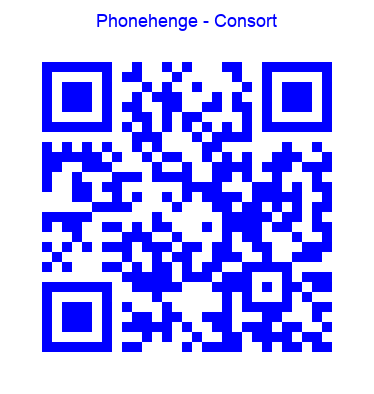

# Satellite Gamelan

The Satellite Gamelan is a web app designed for a large group of musicians to perform concert music using mobile phones. The app embodies both an animated musical score and a set of instruments to play it.

The instruments are easy to play and quick to learn, enabling musicians to explore uncharted harmonic spaces rarely visited using standard musical instruments. Every phone becomes a mobile sound source in a large harmonic constellation and a hand-held stage light that enhances concert presentation.

Performance relies on a choir of miniature speakers to project sound into reverberant concert venues that were designed to propagate the unamplified sound of multiple hand-held instruments and a cappella voices.

The app renders a synchronised multiplayer interface using gesture-triggered audio and ES6 canvas animation. It was designed as a [concert app](https://satellitegamelan.com) to perform microtonal music composed by the developer initially to explore microtonal tuning theories of [Erv Wilson](https://www.anaphoria.com/wilson.html). The source code here is intended as an eventual replacement of the original app written in Objective-C. It uses a combination of JavaScript and [Csound](https://csound.com/index.html) [WebAssembly](docs/server.md) and draws on the work of New Zealand composer and computer music pioneer [Barry Vercoe](https://www.media.mit.edu/posts/in-memoriam-barry-lloyd-vercoe-1937-2025/) and an international community of [Csound developers](docs/server.md). In the spirit of Vercoe I have released the code into the wild.

This version of the code evolved to support the realisation of *Phonehenge*, a work where musicians can explore the harmonic properties of a [non-octave tuning system](docs/tuning.md) with 25 equally spaced pitches, devised by Karlheinz Stockhausen for his 1954 electronic work [*Studie II*](https://joachimheintz.de/stuecke/code/stockhausen_studie_II_LAC_2010.pdf).

## Features

- 🎵 **Csound audio synthesis** via dynamic gesture-triggered loading
- 🌐 **Async** server provides secure **HTTP** and **WebSocket** services
- ✅ Mobile-friendly, multi-player, autoplay-policy compliant
- 🔁 Collaborative GUI for a consort of players synchronised by a lead player
- 🎨 Canvas-based layout and animation in pure ES6 modules
- 📡 **Application** runs untethered from the internet

## 📁 Project File Structure

```text
.
├── apple-touch-icon-precomposed.png
├── apple-touch-icon.png
├── assets
│   ├── bash
│   │   └── zshrc
│   ├── certs
│   ├── csd
│   │   ├── phonehenge-0.csd
│   │   ├── phonehenge-1.csd
│   │   ├── phonehenge-2.csd
│   │   ├── phonehenge-3.csd
│   │   ├── phonehenge-4.csd
│   │   ├── sprite-chords.orc
│   │   ├── sprite-single.csd
│   │   └── sprite-single.orc
│   ├── python
│   │   ├── make-qr.py
│   │   └── server.py
│   └── qr-images
│       ├── qr-consort.png
│       └── qr-leader.png
├── consort.html
├── css
│   └── bootstrap.min.css
├── favicon.ico
├── js
│   ├── gui
│   │   ├── animation.js
│   │   ├── audioEngine.js
│   │   ├── canvasExtensions.js
│   │   ├── canvasUtils.js
│   │   ├── clockBus.js
│   │   ├── clockTransport.js
│   │   ├── color.js
│   │   ├── csoundInit.js
│   │   ├── globals.js
│   │   ├── helpers.js
│   │   ├── henge.js
│   │   ├── main.js
│   │   ├── net.js
│   │   ├── renderer.js
│   │   ├── runTime.js
│   │   ├── satgamPing.js
│   │   ├── sequence.js
│   │   ├── sprites.js
│   │   ├── text.js
│   │   ├── uiControls.js
│   │   └── wakeLock.js
│   └── synth
│       ├── csound6
│       │   ├── csound.js
│       │   └── csound.js.map
│       └── csound7
│           ├── csound.js
│           └── csound.js.map
├── leader.html
├── LICENSE
└── README.md

16 directories, 58 files
```

 assets/docs/     Supporting PDF, TeX, CSV, and notation source files
 assets/md-images Images used by Markdown documentation
 assets/certs     ready-to-use server certificates and mobile deployment certificates

## Documentation
- [Tuning](https://github.com/GregSchiemer/SatGam#tuning)
- [Concert Instructions](https://github.com/GregSchiemer/SatGam#concert-instructions)
- [Player Instructions](https://github.com/GregSchiemer/SatGam#player-instructions)
- [Router](https://github.com/GregSchiemer/SatGam#router)
- [Server](https://github.com/GregSchiemer/SatGam#server)
- [Certificates](https://github.com/GregSchiemer/SatGam#certificates)
- [Security](https://github.com/GregSchiemer/SatGam#security)
- [References](https://github.com/GregSchiemer/SatGam#references)
- [satellitegamelan.net](https://github.com/GregSchiemer/SatGam#satellitegamelannet)
- [Acknowledgements](https://github.com/GregSchiemer/SatGam#acknowledgements)

## Tuning 

This section is for anyone curious about why the Satellite Gamelan app sounds the way it does. It shows how a scale that does not repeat at the octave can nevertheless sound surprisingly close to the familiar conventional scale that divides the octave into twelve equal intervals. Stockhausen’s scale divides a much larger 5:1 harmonic span into twenty-five equal steps, producing distinctive timbral qualities unlike those of many octave-based scales used in world music. We may never know whether he was fully aware of its rich harmonic vocabulary, but it is remarkable to think he created it using the stock-in-trade of 1950s broadcast studios: magnetic tape, chinagraph pencil, splicing block, and razor blade. 

Tuning resources developed in Csound now make this scale accessible for experimentation by other musicians. These resources have been adopted for the Satellite Gamelan app and can also be reused by users of hand-held mobile synthesisers who would like to explore other musical scales.


This overview of **[Stockhausen's Scale](assets/docs/stockhausen_25root5.pdf)** shows

- how the 25 pitches are calculated and mapped to 25 keys on a hand-held digital synthesiser
- where these pitches sit in comparison to notes on a conventional music stave, and
- how close they are to the 5-limit harmonic ratios they approximate.

## Concert instructions

Players download the app to their phone from a local server via a Wi-Fi Router. The app is launched by scanning 1 of 2 QR codes depending on their role in the performance : one QR code launches leader.html, the other launches consort.html

<p>
  
  
</p>

- **Lead player** (`leader.html`) lead player taps the digital clock readout to start an animation sequence that drives the performance
- **Consort** (`consort.html`) all players trigger sounds by tapping sprites enabled by the animation sequence
- Both versions display the same 25-key layout and interactive clock
- The lead player synchronises all phones in the consort via a Wi-Fi 6 Router

The leader's role is: 
- to start the animation sequence in sync on all phones;
- to select 1 of 2 playing modes for playing the animation sequence :

    1. **PREVIEW** : plays 'fast-forward' giving players an overview of the changing UI
    2. **CONCERT** : plays in real-time and lasts between 12:24 and 12:48 seconds 

## Player instructions

The app has an animated sequence of states where 25 coloured keys appear and disappear at various times during the performance.

- before starting the performance players set phones in wake mode

- the sequence starts when the lead player taps the clock 

- players trigger notes by tapping keys as they appear

- in each state a player may play up to 5 notes


## Router 

<p>
  
</p>

[SatGam Router Settings PDF](assets/docs/satgam_router_settings.pdf)

How to set up [tp-link AX73 Wi-Fi 6 Router](https://youtu.be/5nZY1M_RH-k)


## Server
 
The Satellite Gamelan app uses ‘aio_server.py`, a server that includes an efficient service for sending hypertext messages to all phones and a web socket that allows a lead phone to broadcast messages to other phones in the consort.  

Before the app is launched for the first time, a certificate must be installed. Once installed, the app can be launched  from Terminal using the following command settings :
```text
	cd /Users/gs/Developer/SG/SatGam
```

    Then run the server:

```text
	python3 assets/python/aio_server.py \
	  --port 8443 \
	  -r .
```

    The default port is 8443.

    When the server starts successfully, the Terminal should show messages similar to:

```text
	diag_client=False log_http=False log_ws=True log_assets=True log_client_status=True
	[https+wss] Serving /Users/gs/Developer/SG/SatGam
	[https+wss] https://0.0.0.0:8443
	[https+wss] WebSocket endpoint: wss://0.0.0.0:8443/ws
```
    **NOTE**
    0.0.0.0 means the server is listening on all local interfaces, including:
	  - localhost
	  - the home-side interface
	  - the AX73-side interface
	  - 192.168.1.10

    Additional command options include:

```text
		--cert-file assets/certs/SatGam.pem

```				
			Uses the SatGam public certificate file.		
	
```text
		--key-file assets/certs/SatGam-key.pem
```		
			Uses the SatGam private encryption key

```text
		--log-ws
```
	Displays WebSocket messages in the Terminal console log.

```text
		--log-assets
```
	Identifies assets sent to phone clients.

```text
		--diag-client
```
	Displays diagnostic status messages on phone clients.

## Certificates

Before the Satellite Gamelan app is launched for the first time, phones need reassurance that it is a trusted app that runs Csound as an audio synthesiser inside a mobile web browser. The certificate provides that reassurance, allowing the Satellite Gamelan to launch without raising security alerts and alarming the phones' owners. 

A local http server 'server.py' is used to download, install and trust the Satellite Gamelan root certificate. To do that laptop and phones must connect to the local area network to download the certificate from the laptop. Phones are already secure because the Wi-Fi Router is not connected to the internet. In a **terminal** window, type the following :

```text
		python3 assets/python/server.py --root . --http-port 8000 --ws-port 8010
```
When `server.py` launches, the following appears in the console window :

```text
		——— Preflight ———
		✅ no auto-start in main.js
		✅ robust wsPort parsing present (qsPort)
		⚠️ leader.html did not show a direct import during preflight (static check). If you see [ws] connections later, WS is wired at runtime.
		⚠️ consort.html did not show a direct import during preflight (static check). If you see [ws] connections later, WS is wired at runtime.
		———— End preflight ————
		[diag] log_http=True log_ws=True log_user_agent=False log_assets=True log_client_status=True
		[ws] Listening on ws://0.0.0.0:8010
		[http] Serving /Users/gs/Developer/SG/SatGam on http://0.0.0.0:8000
```
	In a second **terminal** window, launch **registration.html** :
		
```text
		open registration.html
```

The registration page opens displays a QR code that players scan with their phone. This launches the registration page on the phone where the root certificate can be downloaded, installed and trusted on either an Android phone or iPhone.
<p>
  
</p>

Once the certificate is downloaded, installed and trusted, a secure server is launched creating a secure pathway for players to download and launch the Satellite Gamelan app on the phone. All players in the consort, except the leader, scan the following QR code :

<p>
  
</p>

##📱 Security

**No internet connection** is reported when a phone first connects to the Vercoe network —— cause for both celebration and caution. The Wi-Fi router lets a consort of players connect to the Vercoe network and share the Satellite Gamelan concert app on their phones without connecting to the internet. Whileever the phone has no internet connection the owner's personal data will not fall prey to klepto-hyenas that lurk on the dark web.

However once the concert is finished and the phone returns to normal use, players are advised to remove the certificate from their phone. This will prevent a hypothetical scenario whereby an internet scammer might use the certificate to launch a malicious application and steal personal information that was protected while the Satellite Gamelan app was in use. The steps that follow will prevent such a scenario from ever happening.

**⚙️ To remove the certificate from an iPhone**

	Go to 
	- Settings 
	- General 
	- VPN & Device Management 
	- Configuration Profile
	- select 'Satellite Gamelan Root Certificate'
	- tap 'Remove Profile'

If 'Satellite Gamelan Root Certificate' is not found under **Configuration**, it is already removed.

**⚙️ To Remove the certificate from an Android phone**

	Go to 
	- Setting 
	- Security & privacy 
	- Encryption & credentials
	- Trusted credentials 
	- User
	- select 'mkcert development CA' 
	- tap 'UNINSTALL'

If 'mkcert development CA' is not found under **User**, it is already removed.

[More ways to remove certificates](https://www.xolphin.com/support/FAQ/Removing_root_certificates)

## References

- K. Grady (2024) [An Extended Interview with Greg Schiemer](https://www.xenharmonikon.org/2024/09/13/an-extended-interview-with-greg-schiemer/)
- T. Narushima (2018) [Microtonality and the Tuning Systems of Erv Wilson](https://www.routledge.com/Microtonality-and-the-Tuning-Systems-of-Erv-Wilson/Narushima/p/book/9781138857568)
- S. J. Taylor (2011) [The Sonic Sky](https://vimeo.com/29632431?fl=pl&fe=vl)
- G. Schiemer (2016) [Satellite Gamelan: microtonal sonification using a large consort of mobile phones](https://www.academia.edu/103469473/Satellite_Gamelan_Microtonal_Sonification_Using_a_Large_Consort_of_Mobile_Phones)
- G. Schiemer, E. Deleflie, E. Cheng (2010) [Pocket Gamelan: Realizations of a Microtonal Composition on a Linux Phone Using Open Source Music Synthesis Software](https://www.academia.edu/1073448/Pocket_Gamelan_Realizations_of_a_Microtonal_Composition_on_a_Linux_Phone_Using_Open_Source_Music_Synthesis_Software)
- G. Schiemer and M. Op de Coul (2007) [Pocket Gamelan: tuning microtonal applications in Pd using Scala](https://ro.uow.edu.au/ndownloader/files/50561721)
- G. Schiemer (2006) [The microtonal legacy of the Pocket Gamelan](https://ro.uow.edu.au/ndownloader/files/50561544)
- G. Schiemer and M. Havryliv (2006) [Pocket Gamelan: tuneable trajectories for flying sources in *Mandala 3* and *Mandala 4*](https://www.academia.edu/85041071)
- G. Schiemer and M. Havryliv (2005) [Pocket Gamelan: a Pure Data interface for Mobile phones](https://www.nime.org/proceedings/2005/nime2005_156.pdf)

## satellitegamelan.net

- [index](https://satellitegamelan.com/index.php)
- [links](https://satellitegamelan.com/links.php)
- [gallery](https://satellitegamelan.com/gallery.php)
- [about](https://satellitegamelan.com/about.php)

## Acknowledgements

- Australian Research Council, 2003-2005 Discovery Project ( DP0346291 ), project title : *Tuning Musical Applications for Wireless Internet* 
- Australian Tax Payers
